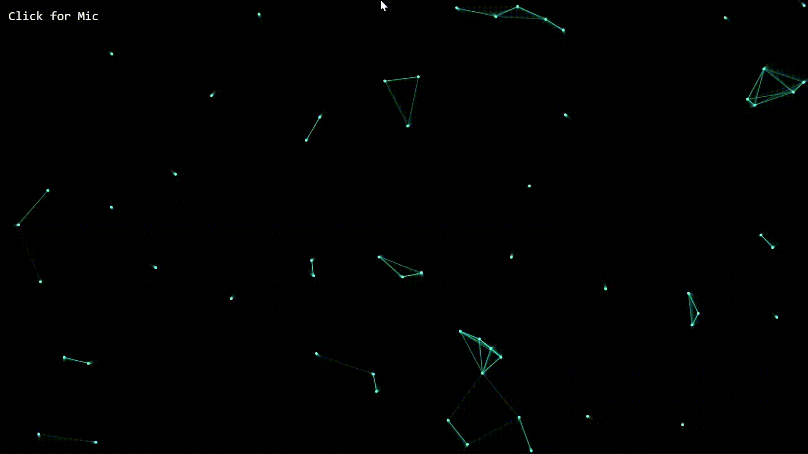
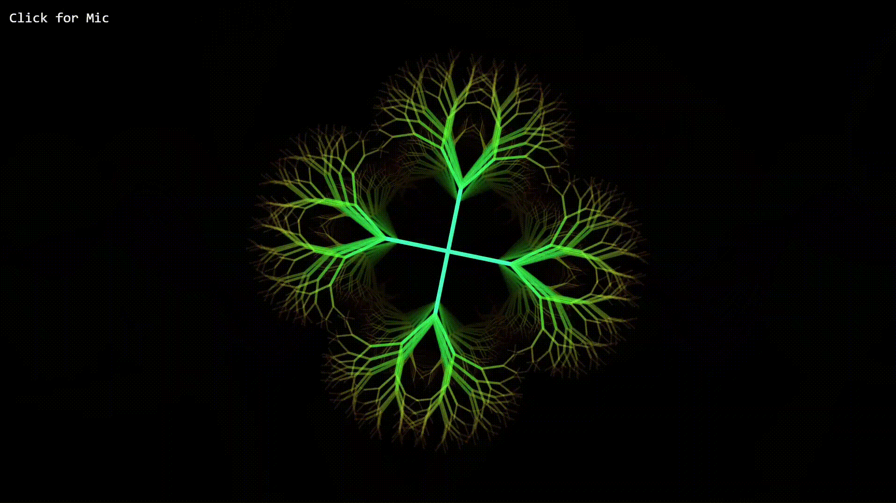

# 🎭 Carnival Visual Effects

[](https://developer.mozilla.org/en-US/docs/Web/HTML) [](https://developer.mozilla.org/en-US/docs/Web/JavaScript) [](LICENSE)

I developed this standalone web visualizer to project `audio-reactive` effects on screens during the Carnival DJ set at my student dorm.
Built strictly with **HTML5 Canvas** and **Vanilla JavaScript**, it uses the Web Audio API to draw over 20 dynamic patterns perfectly synced to the music beat.

---

## 🚀 Features & Upgrades (V2)

- 🎤 **Audio-Reactive Engine**: Syncs visuals to environmental audio via device microphone using `AnalyserNode` FFT data.
- 🎨 **22 Unique Patterns**: From Oscilloscopes and Flowing Waves to Quantum Nodes, Liquid Blobs, and Neon DNA.
- 🖥️ **Ultrawide & Multi-Screen Support**: Optimized rendering radiuses and dynamic side-fillers to eliminate dead zones on wide projection setups.
- ⏱️ **Fallback BPM System**: Manual BPM adjustment mode with an on-screen HUD for scenarios where microphone access is restricted.
- 🔄 **Auto-Rotation**: Switches to a new random pattern every 3 minutes to keep the visual flow fresh.
- ⚡ **Zero Dependencies**: Pure Vanilla JS, relying entirely on native Web APIs for maximum performance and zero build-step overhead.

---

## 📸 Preview


<table align="center" style="border: none;">
  <tr>
    <td align="center" width="50%" valign="top">
      <br><br>
      <b>Quantum Nodes & Liquid Bob</b><br>
      Interconnected audio-reactive nodes and beat-synced fluid dynamics
    </td>
    <td align="center" width="50%" valign="top">
      <br><br>
      <b>Oscilloscope & Audio Spark</b><br>
      Frequency-based waveform distortion with triggered particle sparks
    </td>
  </tr>
  <tr>
    <td align="center" width="50%" valign="top">
      <br><br>
      <b>Flowing Waves & Particle Storm</b><br>
      Phase-shifting sine waves rendered within a chaotic particle field
    </td>
    <td align="center" width="50%" valign="top">
      <br><br>
      <b>Fractal Sync</b><br>
      Recursive geometric fractal structures scaling to bass frequencies
    </td>
  </tr>
</table>

---

## 🧠 Technical Architecture

The core rendering engine is built around a highly optimized `requestAnimationFrame` loop. 
Instead of relying on heavy physics libraries, the visualizer uses native trigonometric functions (Sine/Cosine for polar coordinates) and an exponential decay logic (`hit *= 0.85`) to simulate smooth easing animations following raw audio impulses. 

Low frequencies (bass) are isolated from the FFT array to trigger beat events, ensuring the visuals pulse strictly to the kick drum of the music.

### ⌨️ Controls
- **Click anywhere**: Initialize AudioContext and request microphone permissions.
- **`N`**: Skip to the next random pattern.
- **`+/-`**: Manually increase/decrease BPM if the mic fails.
---

## ⚙️ Installation & Usage

No `npm install` or build process required.

1. Clone the repository:
   ```bash
   git clone https://github.com/mirconegri/CarnivalVisualEffects.git
   cd Carnival-Visual-Effects

 * Open pattern-drawer.html in any modern web browser.
 * Grant microphone permissions when prompted to enable audio-reactivity.
⚠️ Security Note: Most modern browsers block microphone access on file:// protocols. For local testing, serve the directory via a local web server (e.g., python3 -m http.server 8000 or VSCode Live Server).


---

## 📜 License

MIT License © 2026 `Mirco Negri` — see [LICENSE](LICENSE) file for details.

---

## 👤 Author

`Mirco Negri` 

GitHub: https://github.com/mirconegri

Portfolio: https://mirconegri.github.io/Portfolio/

